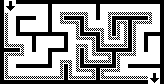
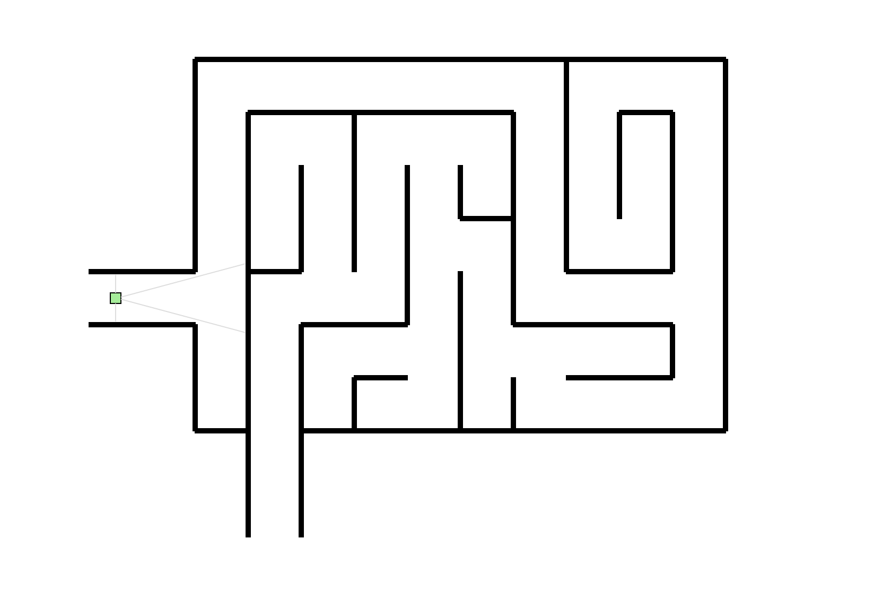
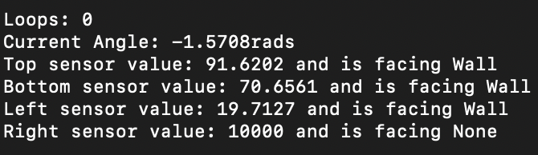

# EEP 520 - Final Project

## Overview

**The goal of this project is to create a robot that can automatically traverse through a maze**

The goal of this project is to incorporate a robot that can traverse through a maze
no problem. The idea of how the robot moves and determines its path is based on
the "Wall Follower" maze solving algorithm. By keeping one "hand" in contact with
the wall on either your right, or left, 


Below here, is the maze map and robot that was used for this experiment. Each black
rectangle representing a wall and a green square to represent the robot. The two grey
lines facing forward is to determine if any walls are in front of the robot and the two
on the side are used to determine what direction to go based on how far a wall might
be on each side.



In addition, all attributes are shown. The sensor value of all lines shown in the photo
with the robot, determining how far a wallk might be. The description of what the sensor
is looking at, i.e, a wall. The rotational angle of the robot in radians and the number
of times the robot has completed the maze, i.e, Loops.



## Key Challenges

* **Determining managable speeds**: If not done properly, the speed will heavily
influence how well the robot can turn and move. Mostly just trial and error to
find the perfect speed that could be used for traversing through the maze without
the robot hitting the wall

* **Implementation of State Machines**: Implementing a state machine seemed to 
not work correctly during my testing phases. If put in properly, the robot
would most definitely would've had an easier time getting to the end of the
maze. But with the little time that I had, I decided to incorporate a second
sensor to help the robot traverse without a state machine. 

* **Creating a maze**: Took a long time to actually get all the pieces lined up,
but I created a maze that would seem sufficient enough for the job.

* ***Looping Maze**: To display the consistency of the robot, I needed it to
repeat the maze indefinitely, or at least until the program was terminated.
This way I know that the robot can go through the maze multiple times and
not just get lucky in the first run.

Below, I have some lab notes I was taking as I traversed through the project.


## How to Install and Run the code

**This guide assumes that you already have docker and its needed image installed.**
**If you require a guide for docker, please refer to https://github.com/klavinslab/enviro**

Install the git repo, Make sure docker source is linked to this repo with your working directory
```bash
git clone https://github.com/FraserJordan1/520-FinalProject.git 
```

Start up your docker container
```bash
docker start $CONTAINER_ID
```

Then simply connect to the container
```bash
docker attach $CONTAINER_ID
```

Once you're all setup on docker, simply run the make file to compile all code
and then esm start to make sure that configurations are in order
```bash
make
esm start
```

When compiling finishing, all you have to do is run the server with this simple command
```bash
enviro
```

Once you've started the enviro server, you can find the resulted map on your
local server; i.e, `http://localhost`

From here, all you have to do is watch the robot solve the maze.

When you're done running the server, simply press `Ctrl-C` at the `bash` interface.


## Acknowledgments and Sources

**Klavins Lab from UW used within project**
https://github.com/klavinslab/elma
https://github.com/klavinslab/elma_project
https://github.com/klavinslab/enviro

**Information collection on the Maze Solving Algorithm**
https://en.wikipedia.org/wiki/Maze-solving_algorithm#/media/File:Maze01-02.png
https://github.com/john-science/mazelib/blob/main/docs/MAZE_SOLVE_ALGOS.md


